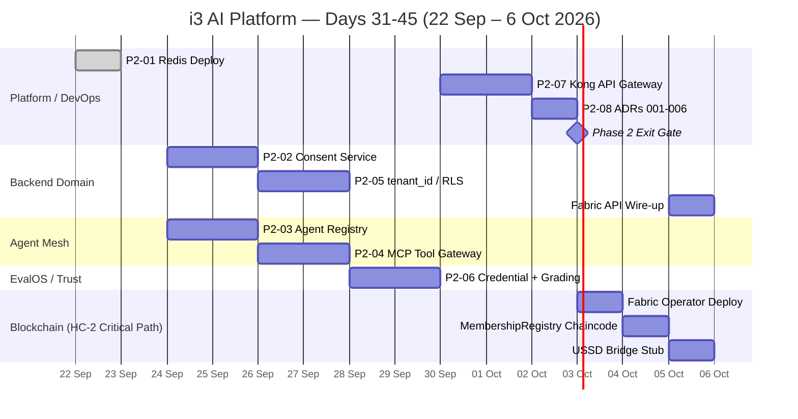

# i3 AI Platform — 45-Day Master Plan (Consolidated)
## PLN-06 · Dependency-Ordered Task Graph · Squad Allocation · Weekly Milestones · Phase Exit Gates

**Baseline Date:** 22 September 2026  
**Plan Window:** 45 calendar days → **6 November 2026**  
**Days Completed:** 30 (Days 1–30 closed)  
**Days Remaining:** 15 (Days 31–45, starting 22 September 2026)  
**IEBC Hard Deadline:** 16 March 2027 (Hyperledger Fabric staging live by November 2026 — HC-2)  
**Classification:** Internal Engineering — Architecture

---

## Context: What Days 1–30 Delivered (Phase 1 — COMPLETE)

Phase 1 (Foundation) ran Days 1–30 and closed all 12 atomic steps. All exit gates are green.

| Gate | Check | Status |
|------|-------|--------|
| P1-GATE-01 | No raw passwords in tracked files | ✅ |
| P1-GATE-02 | `.env.local` not tracked by git | ✅ |
| P1-GATE-03 | `secret-scan` Tekton stage → Succeeded | ✅ |
| P1-GATE-04 | `PrometheusRule i3-platform-alerts` exists | ✅ |
| P1-GATE-05 | Grafana StatefulSet READY 1/1 | ✅ |
| P1-GATE-06 | Grafana PVC Bound | ✅ |
| P1-GATE-07 | OTel end-to-end trace in Langfuse with `tenant_id` | ✅ |
| P1-GATE-08 | OTP rate-limit test PASSED | ✅ |
| P1-GATE-09 | skills-assessor isolation test PASSED | ✅ |
| P1-GATE-10 | RAGAS faithfulness ≥ 0.80, relevancy ≥ 0.75 | ✅ |
| P1-GATE-11 | No `new_event_loop`/`asyncpg.connect` in consumers | ✅ |
| P1-GATE-12 | Langfuse host = `i3-model-gateway` in LiteLLM config | ✅ |

**Capabilities unlocked by Phase 1 (required before any Phase 2 step):**
- OpenBao KV v2 at `i3/` — unsealed and populated
- Redis `redis.i3-data.svc.cluster.local:6379` — deployed and reachable
- Tekton pipeline: `secret-scan → lint-typecheck → run-tests → build-push → trivy-scan → rollout`
- OTel baseline latency profiles captured for all services
- RAGAS CI gate live

---

## Days 31–45: Phase 2 — Domain Decoupling

> **Constraint:** Phase 2 uses the green Phase 1 foundation. No Phase 2 step may begin until P1-GATE-01 through P1-GATE-12 are confirmed green. Phase 2 must deliver the six new bounded-context services, tenant isolation, and API gateway by Day 45 — putting FORD Fabric staging (HC-2, November 2026) on a clear path.

**Phase 2 Capability Ownership (must not be consumed before the owning step passes acceptance):**

| Core Capability | Owning Step | Consumers that must wait |
|-----------------|-------------|--------------------------|
| Redis (multi-service) | STEP-P2-01 (Day 31) | P2-02 consent TTL, P2-03 agent session cache, P2-07 rate-limit |
| Consent Service | STEP-P2-02 (Day 33–34) | FORD OTP dispatch, Engage campaign send, SIT enrollment |
| Agent Registry | STEP-P2-03 (Day 33–34) | MCP Gateway (P2-04), Kong routes (P2-07) |
| MCP Tool Gateway | STEP-P2-04 (Day 35–36) | Admissions + PMaaS agent tool routing |
| tenant_id / RLS | STEP-P2-05 (Day 35–36) | All multi-tenant API queries |
| Credential + Grading | STEP-P2-06 (Day 37–38) | EvalOS submit, SIT credential issuance |
| Kong API Gateway | STEP-P2-07 (Day 39–40) | Replaces direct OpenShift Routes for all external services |
| ADRs 001–006 | STEP-P2-08 (Day 41) | Phase 2 exit gate |

---

## Task Graph — Days 31–45

> Each task is ≤ 2 days. Dependencies are explicit. Tasks with no shared dependency run in parallel.

```
Day 31  P2-T0: Redis Deploy (STEP-P2-01)
         │
         ├─────────────────────────────────────┐
Day 33   P2-T1: Consent Service (P2-02)        P2-T2: Agent Registry (P2-03)
          [depends: P2-T0, P1 gate]             [depends: P2-T0, P1 gate]
         │                                      │
Day 35   P2-T3: tenant_id / RLS (P2-05)        P2-T4: MCP Tool Gateway (P2-04)
          [depends: P1 gate]                    [depends: P2-T2]
         │                                      │
Day 37   P2-T5: Credential + Grading (P2-06)   P2-T6: (continued / integration)
          [depends: P1 gate]                    [depends: P2-T4]
         │
Day 39   P2-T7: Kong API Gateway (P2-07)
          [depends: P2-T2, P2-T4]
         │
Day 41   P2-T8: ADRs 001–006 (P2-08)
          [depends: P2-T1 through P2-T7]
         │
Day 42   Phase 2 Exit Gate Check
         │
Day 43–45 Phase 3 Ramp: Fabric Staging Prep (HC-2 critical path)
```

---

## Detailed Task Breakdown — Days 31–45

### Day 31–32 · STEP-P2-01: Redis Infrastructure Deploy
**Squad:** Platform / DevOps  
**Work quantum:** 1 day (Day 31) + 1 day validation buffer  
**Depends on:** Phase 1 gate green

| # | Task | Files | ≤ Days |
|---|------|-------|--------|
| P2-01-a | Create `platform/deploy/redis/redis-deploy.yaml` — Redis 7.2 StatefulSet with PVC, password from OpenBao `i3/redis/url`, maxmemory 512 MB `allkeys-lru` | `platform/deploy/redis/redis-deploy.yaml` | 0.5 |
| P2-01-b | Add Redis Application to ArgoCD app-of-apps at Wave 1 | `platform/gitops/argocd/app-of-apps.yaml` | 0.5 |
| P2-01-c | Add `i3-data` namespace entry (if absent) to namespace manifest | `platform/namespaces/namespaces.yaml` | 0.25 |
| P2-01-d | Sensor checks: pod Running, `PING → PONG`, reachable from `i3-ford` namespace | — | 0.25 |

**Sensor Gate (must pass before Day 33 tasks start):**
```bash
kubectl get pod -n i3-data -l app=redis                           # Running
kubectl exec -n i3-data redis-0 -- redis-cli ping                 # PONG
kubectl run redis-test --rm -it --image=redis:7.2-alpine \
  -n i3-ford -- redis-cli -h redis.i3-data.svc.cluster.local ping # PONG
```

---

### Day 33–34 · STEP-P2-02: Consent Service + STEP-P2-03: Agent Registry
*Parallel tracks — no dependency between them.*

#### Track A — Consent Service (STEP-P2-02)
**Squad:** Backend Domain  
**Depends on:** STEP-P2-01

| # | Task | Files | ≤ Days |
|---|------|-------|--------|
| P2-02-a | Scaffold `platform/consent/` FastAPI service: `main.py`, `models.py`, `schemas.py`, `migrations/001_init.sql` with `consent_records` and `consent_audit` tables (`tenant_id UUID NOT NULL` on both, HC-4). `subject_id_hash` = HMAC-SHA256 (HC-6). | `platform/consent/` | 1 |
| P2-02-b | Add consent check to Engage campaign send route (before email dispatch) | `platform/engage/web/src/app/api/campaigns/send/route.ts` | 0.5 |
| P2-02-c | Replace `consent: bool` in FORD register endpoint with consent-service call | `platform/ford/api/main.py` | 0.5 |
| P2-02-d | Add `i3-consent` namespace + ArgoCD Wave 2 application | `platform/namespaces/namespaces.yaml`, `platform/gitops/argocd/app-of-apps.yaml` | 0.25 |

**CloudEvent emitted on consent grant:**
```json
{
  "specversion": "1.0",
  "id": "<UUIDv7>",
  "source": "i3/consent-service",
  "type": "i3.consent.record.created",
  "datacontenttype": "application/json",
  "time": "<RFC3339-UTC>",
  "tenantid": "<UUID>",
  "subject": "consent/<consent_id>",
  "data": { "channel": "sms", "purpose": "otp", "status": "granted" }
}
```

**Sensor Gate:**
```bash
kubectl get pod -n i3-consent -l app=consent-service             # Running
curl -s -X POST http://consent-service.i3-consent.svc/consent \
  -d '{"subject_id_hash":"abc","channel":"sms","purpose":"otp",
       "status":"granted","source":"test",
       "tenant_id":"00000000-0000-0000-0000-000000000001","version":1}'
# Expected: HTTP 201
curl -s "http://consent-service.i3-consent.svc/consent/unknown?channel=sms&purpose=otp"
# Expected: {"allowed": false}
grep -n "consent" platform/engage/web/src/app/api/campaigns/send/route.ts
# Expected: ≥ 1 match
```

---

#### Track B — Agent Registry + Decision Log (STEP-P2-03)
**Squad:** Agent Mesh  
**Depends on:** STEP-P2-01

| # | Task | Files | ≤ Days |
|---|------|-------|--------|
| P2-03-a | Scaffold `platform/agent-registry/` FastAPI service with `agent_registry` and `agent_decision_log` DDL. `tenant_id UUID NOT NULL` (HC-4). HTTP API: GET/POST `/agents`, PATCH `/agents/{id}/state`, POST `/decisions`. | `platform/agent-registry/` | 1 |
| P2-03-b | Write 6 agent YAML manifests: `admissions-agent`, `pmaas-campaign-agent`, `onboarding-planner`, `onboarding-subagent-infra`, `onboarding-subagent-ailab`, `onboarding-subagent-backend`. All `autonomy_tier: L1` (HC-3). Include `risk_tier`, `side_effect_class`, `cost_budget_tokens`. | `platform/agent-registry/manifests/*.yaml` | 0.5 |
| P2-03-c | Add fire-and-forget decision log emission to admissions agent and PMaaS campaign agent | `platform/admissions/admissions_agent.py`, `platform/pmaas/agents/campaign_agent.py` | 0.5 |
| P2-03-d | Add decision log emission to onboarding planner and base-scan | `onboarding-agent/src/orchestrator/planner.ts`, `onboarding-agent/src/orchestrator/subagents/base-scan.ts` | 0.5 |
| P2-03-e | Add `i3-agent-mesh` namespace + ArgoCD Wave 4.5 application | `platform/namespaces/namespaces.yaml`, `platform/gitops/argocd/app-of-apps.yaml` | 0.25 |

**Manifest schema (every agent — enforced fields):**
```yaml
agent_id: <agent-name>-v1
name: <Human Name>
version: "1.0.0"
autonomy_level: L1          # HC-3: never L2 or L3
risk_tier: low              # low | medium | high
side_effect_class: read-only  # read-only | propose | execute-gated
allowed_tools: [...]
forbidden_tools: [...]
cost_budget_tokens: 50000
guardrail_policy: lobster-trap-v1
state: active
```

**Sensor Gate:**
```bash
kubectl get pod -n i3-agent-mesh -l app=agent-registry          # Running
curl -s http://agent-registry.i3-agent-mesh.svc/agents \
  | python3 -c "import sys,json; print(len(json.load(sys.stdin)))"
# Expected: 6
kubectl exec -n i3-agent-mesh deploy/agent-registry -- python3 -c "
import yaml, glob
for f in glob.glob('/app/manifests/*.yaml'):
    m = yaml.safe_load(open(f))
    assert m['autonomy_tier'] in ('L0','L1'), f'FAIL: {f}'
print('OK')"
# Expected: OK
```

---

### Day 35–36 · STEP-P2-04: MCP Tool Gateway + STEP-P2-05: tenant_id / RLS
*Parallel tracks — no dependency between them (P2-04 depends on P2-03; P2-05 depends on P1 gate only).*

#### Track A — MCP Tool Gateway (STEP-P2-04)
**Squad:** Agent Mesh  
**Depends on:** STEP-P2-03

| # | Task | Files | ≤ Days |
|---|------|-------|--------|
| P2-04-a | Scaffold `platform/mcp-gateway/` FastAPI service. Tool schema: `name`, `version`, `risk_tier`, `side_effect_class`, `requires_human_gate`, `tenant_scoped`. HTTP: `POST /tools/{name}/invoke`. Validate `X-Agent-Id` against agent registry `allowed_tools`. | `platform/mcp-gateway/` | 1 |
| P2-04-b | Register 6 platform tools with risk declarations (chroma.search T0, litellm.chat T1, calendar.book T2, odoo.crm.create T2, kafka.produce T2, postgres.members.write T3). `requires_human_gate: true` for T3. | `platform/mcp-gateway/tools/` | 0.5 |
| P2-04-c | Refactor admissions agent: replace direct ChromaDB calls with gateway calls via `X-Agent-Id: admissions-agent-v1` | `platform/admissions/admissions_agent.py`, `platform/admissions/mcp/mcp_connectors.py` | 0.5 |
| P2-04-d | Refactor PMaaS campaign agent: replace direct ChromaDB/LiteLLM calls with gateway calls | `platform/pmaas/agents/campaign_agent.py` | 0.5 |
| P2-04-e | Add NetworkPolicy: agent namespaces → mcp-gateway port 8100 | `platform/namespaces/network-policies.yaml` | 0.25 |

**Every MCP tool spec (mandatory fields per mode rules):**
```python
class McpToolSpec(BaseModel):
    name: str
    version: str
    risk_tier: Literal["low", "medium", "high"]
    side_effect_class: Literal["read-only", "propose", "execute-gated"]
    requires_human_gate: bool    # true for all execute-gated tools
    tenant_scoped: bool          # true for all tools that access tenant data
    rate_limit_rpm: int
    timeout_ms: int
    audit_required: bool
```

**Sensor Gate:**
```bash
kubectl get pod -n i3-agent-mesh -l app=mcp-gateway             # Running
curl -s -X POST http://mcp-gateway.i3-agent-mesh.svc/tools/postgres.members.write/invoke \
  -H "X-Agent-Id: admissions-agent-v1" \
  -d '{"input":{"test":true}}'
# Expected: 403  (tool not in admissions-agent allowed_tools)
grep -n "mcp.gateway\|mcp_gateway\|MCPGATEWAY" platform/admissions/admissions_agent.py
# Expected: ≥ 1 match
grep -n "chromadb\.\|chroma_client\." platform/admissions/admissions_agent.py
# Expected: 0 (direct calls removed)
```

---

#### Track B — tenant_id + RLS on Engage, PMaaS, FORD (STEP-P2-05)
**Squad:** Data Platform  
**Depends on:** Phase 1 gate

| # | Task | Files | ≤ Days |
|---|------|-------|--------|
| P2-05-a | Write `002_add_tenant_id.sql` for `engage_db`: ADD COLUMN → backfill default → NOT NULL → RLS policy → composite index on `(tenant_id, created_at DESC)` for `email_campaigns`, `contacts`, `contact_lists`, `inbound_messages` | `platform/engage/web/migrations/002_add_tenant_id.sql` | 0.5 |
| P2-05-b | Write `002_add_tenant_id.sql` for `pmaas_db`: same pattern for `campaigns`, `voters`, `ward_targets` | `platform/pmaas/web/migrations/002_add_tenant_id.sql` | 0.5 |
| P2-05-c | Write `002_add_tenant_id.sql` for `ford_db`: `members_pii`, `agent_velocity` | `platform/ford/api/migrations/002_add_tenant_id.sql` | 0.25 |
| P2-05-d | Update Engage route handlers to extract `tenant_id` from NextAuth session and pass to pool as `SET app.tenant_id` | `platform/engage/web/src/app/api/campaigns/route.ts`, `contacts/route.ts`, `lists/route.ts` | 0.5 |
| P2-05-e | Update PMaaS route handlers similarly | `platform/pmaas/web/src/app/api/**` | 0.5 |

**Sensor Gate:**
```bash
psql $ENGAGE_DB_URL -c "\d email_campaigns" | grep tenant_id
# Expected: tenant_id | uuid | not null
psql $ENGAGE_DB_URL -c "SELECT relrowsecurity FROM pg_class WHERE relname='email_campaigns';"
# Expected: t
# Cross-tenant leakage test: insert row as tenant-A, query as tenant-B → 0 rows
```

---

### Day 37–38 · STEP-P2-06: Credential Service + Grading Service
**Squad:** EvalOS / Trust  
**Depends on:** Phase 1 gate

| # | Task | Files | ≤ Days |
|---|------|-------|--------|
| P2-06-a | Scaffold `platform/grading/` FastAPI service: `POST /grade` with `question_snapshot` + `answers` → `score`, `passed`, `domain_breakdown`. `tenant_id UUID NOT NULL` (HC-4). | `platform/grading/` | 1 |
| P2-06-b | Scaffold `platform/credential/` FastAPI service: `POST /credentials` → W3C VC JSON + `qr_token`. `GET /credentials/{qr_token}/verify` (public). `tenant_id UUID NOT NULL`. Prepare Fabric anchor slot (Phase 3 hook). | `platform/credential/` | 1 |
| P2-06-c | Refactor EvalOS submit route to delegate scoring to grading-service | `platform/evalos/web/src/app/api/exam/[examId]/submit/route.ts` | 0.5 |
| P2-06-d | Replace `Math.random()` Fisher-Yates in EvalOS start route with `crypto.getRandomValues()` | `platform/evalos/web/src/app/api/exam/[examId]/start/route.ts` | 0.25 |
| P2-06-e | Refactor SIT credential issuance to call credential-service | `platform/sit/api/main.py` | 0.5 |

**Sensor Gate:**
```bash
grep -n "Math.random" "platform/evalos/web/src/app/api/exam"    # 0 matches
# POST /grade with known inputs → correct score
# POST /credentials + GET /credentials/{qr}/verify → valid:true
npm test -w platform/evalos/web                                   # all pass
```

---

### Day 39–40 · STEP-P2-07: Kong API Gateway — External Route Authentication
**Squad:** Platform / Security  
**Depends on:** STEP-P2-03 (agent registry running), STEP-P2-04 (MCP gateway running)

| # | Task | Files | ≤ Days |
|---|------|-------|--------|
| P2-07-a | Create `platform/deploy/api-gateway/kong-deploy.yaml`: Kong 3.x Deployment, Service, DB-less mode config | `platform/deploy/api-gateway/kong-deploy.yaml` | 0.5 |
| P2-07-b | Create `platform/deploy/api-gateway/kong-routes.yaml`: KongIngress/Route CRDs for 6 external services. JWT plugin → Keycloak JWKS. Rate-limit plugin: 100 RPM default, 10 RPM LLM endpoints (via Redis). | `platform/deploy/api-gateway/kong-routes.yaml` | 0.5 |
| P2-07-c | Remove `allow_origins=["*"]` from all 5 Python services; replace with gateway-level CORS scoped to known origins | `platform/admissions/admissions_agent.py`, `platform/ford/api/main.py`, `platform/talent/api/main.py`, `platform/pmaas/agents/campaign_agent.py`, `platform/voice/tts/tts_service.py` | 0.5 |
| P2-07-d | Add `i3-gateway` namespace + ArgoCD Wave 1.8 application | `platform/namespaces/namespaces.yaml`, `platform/gitops/argocd/app-of-apps.yaml` | 0.25 |
| P2-07-e | Validate: unauthenticated request → 401; authenticated request → 200; run RAGAS regression | — | 0.25 |

**External routes:**
```
https://api.i3technologies.co.ke/engage/*      → engage-web.i3-engage.svc:3000
https://api.i3technologies.co.ke/evalos/*      → evalos-web.i3-evalos.svc:3000
https://api.i3technologies.co.ke/admissions/*  → admissions-agent.i3-admissions.svc:8000
https://api.i3technologies.co.ke/pmaas/*       → pmaas-agent.i3-pmaas.svc:8000
https://api.i3technologies.co.ke/onboarding/*  → onboarding-agent.i3-admissions.svc:3000
https://api.i3technologies.co.ke/voice/*       → tts-service.i3-voice.svc:8000
```

**Sensor Gate:**
```bash
kubectl get pod -n i3-gateway -l app=kong                        # Running
curl -s -o /dev/null -w "%{http_code}" \
  https://api.i3technologies.co.ke/admissions/chat               # 401
curl -s -H "Authorization: Bearer $VALID_TOKEN" \
  https://api.i3technologies.co.ke/admissions/chat \
  -d '{"message":"what programmes do you offer"}'                # 200
grep -rn 'allow_origins.*\*' platform/admissions/ platform/ford/ \
  platform/talent/ platform/pmaas/ platform/voice/               # 0 matches
```

---

### Day 41 · STEP-P2-08: Architecture Decision Records ADR-001 through ADR-006
**Squad:** All leads (one ADR each, 1 hour each)  
**Depends on:** STEP-P2-02 through STEP-P2-07

| ADR | Title | Owner | File |
|-----|-------|-------|------|
| ADR-001 | Consent Service Extraction | Backend Domain | `platform/docs/adr/ADR-001-consent-service-extraction.md` |
| ADR-002 | Agent Registry and Decision Log | Agent Mesh | `platform/docs/adr/ADR-002-agent-registry-decision-log.md` |
| ADR-003 | MCP Tool Gateway | Agent Mesh | `platform/docs/adr/ADR-003-mcp-tool-gateway.md` |
| ADR-004 | Tenant Isolation Strategy | Data Platform | `platform/docs/adr/ADR-004-tenant-isolation.md` |
| ADR-005 | Credential and Grading Service Extraction | EvalOS / Trust | `platform/docs/adr/ADR-005-credential-grading-extraction.md` |
| ADR-006 | API Gateway Introduction | Platform / Security | `platform/docs/adr/ADR-006-api-gateway.md` |

Each ADR must follow the template: **Context → Decision → Consequences → Alternatives Considered → Status**.

---

### Day 42 · Phase 2 Exit Gate Check

Run [`gate-check`](.bob/skills/gate-check/SKILL.md) skill. All of the following must be true:

| # | Exit Criterion | Sensor |
|---|---------------|--------|
| P2-EX-01 | Consent Service live in `i3-consent`; 3 consuming services check consent before PII-touching ops | `kubectl get pod -n i3-consent` → Running; consent check in FORD + Engage + SIT source |
| P2-EX-02 | Agent Registry contains 6 manifests; decision log receiving entries | `GET /agents` → 6; `agent_decision_log` count > 0 after prod request |
| P2-EX-03 | MCP Tool Gateway live; admissions + PMaaS route tool calls through it | `kubectl get pod -n i3-agent-mesh -l app=mcp-gateway`; no direct chromadb in agents |
| P2-EX-04 | `tenant_id` migration applied to `engage_db` and `pmaas_db`; RLS active | `relrowsecurity=t` on all tables; cross-tenant leakage test returns 0 rows |
| P2-EX-05 | Credential Service and Grading Service deployed; consumed by EvalOS + SIT | `POST /grade` and `POST /credentials` return correct results |
| P2-EX-06 | Kong API Gateway live; all 5 previously-unauthenticated services require JWT | unauthenticated → 401 on all 6 routes |
| P2-EX-07 | ADRs 001–006 merged to `main` | `ls docs/adr/ADR-00{1,2,3,4,5,6}-*.md \| wc -l` → 6 |
| P2-EX-08 | No RAGAS regression: faithfulness ≥ 0.80, relevancy ≥ 0.75 | `pytest platform/testing/testing.py --ragas` → PASSED |
| P2-EX-09 | Locust p95 latency within +15% of Phase 1 baselines | Locust report vs `docs/baselines/p1-performance-baseline.md` |
| P2-EX-10 | Zero new Critical or High findings in Phase 2 code | `trivy image` scan vs baseline in `docs/baselines/p1-performance-baseline.md` |
| P2-EX-11 | No agent manifest with `autonomy_level: L2` or `L3` | manifest YAML scan → 0 matches |
| P2-EX-12 | PLN-05 STEP-04: no `REPLACE_FROM_VAULT` in admissions-deploy.yaml | `grep "REPLACE_FROM_VAULT" platform/admissions/admissions-deploy.yaml` → 0 matches |
| P2-EX-13 | PLN-05 STEP-05: `KEYCLOAK_ISSUER` in admissions-deploy.yaml is HTTPS realm URL | `grep "KEYCLOAK_ISSUER" platform/admissions/admissions-deploy.yaml \| grep -v localhost` → match |
| P2-EX-14 | PLN-05 STEP-07: HMAC hash used for subject in campaigns/send (no raw email fallback) | `grep "TODO.*HMAC\|subject_id_hash.*email" platform/engage/web/src/app/api/campaigns/send/route.ts` → 0 matches |
| P2-EX-15 | PLN-05 STEP-09: `i3-onboarding` namespace present in namespaces.yaml | `grep "i3-onboarding" platform/namespaces/namespaces.yaml` → match |

---

### Days 43–45 · Phase 3 Ramp: FORD Fabric Staging Preparation (HC-2 Critical Path)

> HC-2: **Hyperledger Fabric must be live in staging by November 2026** (IEBC 16 March 2027).  
> Days 43–45 are the critical-path ramp that begins Phase 3 work for FORD before the full Phase 3 sprint starts 7 November 2026.

| Day | Task | Files | Squad |
|-----|------|-------|-------|
| 43 | Deploy Hyperledger Fabric Operator on OpenShift; create `ford-channel` with 3 peer organisations (FORD-Asili, ORPP-observer, Audit-observer) | `platform/ford/fabric/` | Blockchain |
| 43 | Write `MembershipRegistry` Go chaincode stub: `RegisterMember`, `VerifyMember`, `GetWardCount`, `GetAgentDutyCount`. No raw NIDs — accept pre-computed HMAC tokens only (HC-6). Ballot identity goes to `ballotPrivate` collection (HC-8). | `platform/ford/chaincode/membership_registry.go` | Blockchain |
| 44 | Deploy chaincode to `ford-channel`; smoke test `RegisterMember` + `VerifyMember` | — | Blockchain |
| 44 | Add `platform/docs/adr/ADR-007-hyperledger-fabric-membership-ledger.md` | `platform/docs/adr/` | Blockchain |
| 45 | Connect FORD API `platform/ford/api/main.py` line-177 TODO to Fabric SDK call | `platform/ford/api/main.py` | Backend Domain |
| 45 | USSD bridge stub: Africa's Talking USSD → `/api/v1/members/register` routing definition | `platform/ford/ussd/` | Blockchain |

**HC-2 Milestone Checkpoint (Day 45):**
- Fabric Operator deployed on OpenShift cluster
- `ford-channel` created with 3 peer orgs
- `MembershipRegistry` chaincode in staging (not yet production)
- FORD API wired to Fabric SDK (smoke test passing)
- ADR-007 written

This places the full November 2026 Fabric staging target on track with ≥ 6 weeks of buffer.

---

## Squad Allocation Summary

| Squad | Days 31–45 Primary Responsibilities | Members (indicative) |
|-------|-------------------------------------|----------------------|
| **Platform / DevOps** | Redis deploy (P2-01), Kong gateway (P2-07), namespaces, ArgoCD waves | 1–2 engineers |
| **Backend Domain** | Consent service (P2-02), tenant_id migrations (P2-05), FORD API Fabric wire-up | 1–2 engineers |
| **Agent Mesh** | Agent registry (P2-03), MCP tool gateway (P2-04) | 1–2 engineers |
| **EvalOS / Trust** | Credential + grading services (P2-06), Math.random fix, SIT refactor | 1 engineer |
| **Blockchain** | Fabric operator, chaincode scaffold, USSD stub (Days 43–45) | 1–2 engineers |
| **Data Platform** | RLS migrations, cross-tenant leakage tests | 1 engineer |

*Squad members may overlap. Minimum viable squad for this window: 3 engineers.*

---

## Weekly Milestones

| Week | Calendar Dates | Milestone | Exit Signal |
|------|----------------|-----------|-------------|
| **W5** (Day 31–35) | 22–26 Sep 2026 | Redis live · Consent Service live · Agent Registry live with 6 manifests · MCP Gateway scaffolded · tenant_id migrations drafted | P2-01 + P2-02 + P2-03 sensor gates green |
| **W6** (Day 36–40) | 27 Sep – 1 Oct 2026 | MCP Gateway live + agents routed through it · tenant_id RLS active on all tables · Credential + Grading services live · Kong gateway live (JWT gate on all routes) | P2-04 + P2-05 + P2-06 + P2-07 sensor gates green |
| **W7** (Day 41–45) | 2–6 Oct 2026 | ADRs 001–006 merged · Phase 2 exit gate APPROVED · Fabric Operator deployed · `ford-channel` created · `MembershipRegistry` chaincode in staging | P2 exit gate checklist ✅; P2-EX-01 through P2-EX-11 all green; ADR-007 written |

---

## Critical Path Protection

The following sequence is the **critical path to HC-2 (IEBC 16 March 2027)**:

```
Phase 1 COMPLETE (Day 30)
  → Phase 2 EXIT GATE (Day 42)
    → Fabric Operator on OpenShift (Day 43)
      → ford-channel + MembershipRegistry chaincode (Day 44)
        → FORD API Fabric wire-up (Day 45)
          → Full Fabric Staging (November 2026 target)
            → Pilot 1 Internal (January 2027)
              → Pilot 2 Ward-level (February 2027)
                → IEBC Submission: 16 March 2027
```

**Blockers that STOP the critical path (immediate escalation required):**

See full rollback plans and acceptance criteria in [`docs/risks/phase2-risk-register.md`](../risks/phase2-risk-register.md).

| Risk Code | Risk | Trigger | Mitigation |
|-----------|------|---------|------------|
| R1 | OpenBao unsealed / `i3/` paths inaccessible | Any Phase 2 service fails secret injection | Re-unseal procedure; verify SA token binding |
| R2 | Redis unavailable | P2-02 / P2-03 / P2-07 rate-limit fails | Add Redis sentinel; validate PVC binding |
| R3 | Keycloak JWKS unreachable | Kong JWT plugin fails → all routes blocked | Pin JWKS URI to cluster-internal DNS; add health check |
| R4 | IBM Cloud credit exhaustion | Node scheduling failures | Verify quota dashboard; contact IBM TAM (PMC Risk #1) |
| R5 | Phase 2 exit gate blocked | Any P2-EX criterion fails | Raise blocking issue same day; unblock in ≤ 24 h |

---

## Hard Constraint Enforcement Checklist (Phase 2)

Every Phase 2 merge must satisfy all of the following before merging to `main`:

| Constraint | Check |
|-----------|-------|
| HC-3 | No agent manifest contains `autonomy_level: L2` or `L3` |
| HC-4 | Every new SQL DDL has `tenant_id UUID NOT NULL`; every new Kafka CloudEvent envelope has `tenantid` field (non-null UUID) |
| HC-5 | Agents call tools only via MCP gateway; no direct side-effecting calls from agent code |
| HC-6 | All `subject_id_hash` values in consent + registry tables are HMAC-SHA256 (not raw SHA-256, not raw NID) |
| HC-7 | `DEV_BYPASS_AUTH=true` must not appear in any non-gitignored file — CI lint gate blocks merge |
| HC-8 | `MembershipRegistry` chaincode: voter identity in public ledger only; ballot choice in `ballotPrivate` collection only |

**CloudEvent 9-field envelope — mandatory on every new event type introduced in Phase 2:**

| Field | Requirement |
|-------|------------|
| `specversion` | `"1.0"` exactly |
| `id` | UUIDv7 (time-ordered) |
| `source` | `"i3/<service-name>"` |
| `type` | `"i3.<domain>.<entity>.<event>"` reverse-DNS notation |
| `datacontenttype` | `"application/json"` |
| `time` | RFC3339 UTC |
| `tenantid` | Valid UUID — never null, empty, or absent (HC-4) |
| `subject` | Resource path, e.g. `"consent/<id>"` |
| `data` | Domain payload object |

---

## Appendix A — Phase 3 Outlook (Post Day 45)

Phase 3 begins 7 November 2026. The following tracks run in parallel:

| Track | Lead Squad | Target | HC Tie |
|-------|-----------|--------|--------|
| P3-T1: LiteLLM semantic caching + token budgets | Platform | Nov 2026 | — |
| P3-T2: Full async queue (Kafka-backed AI inference) | Backend Domain | Nov 2026 | — |
| **P3-T3: FORD Fabric full staging** | **Blockchain** | **Nov 2026** | **HC-2** |
| P3-T4: CI/CD production gates (RAGAS + promptfoo blocking) | Platform / DevOps | Nov 2026 | — |
| P3-T5: PWA + offline-tolerant Engage / PMaaS clients | Frontend | Nov 2026 | — |

**Phase 3 is blocked by Phase 2 exit gate.** Phase 3 cannot start until all P2-EX criteria are green.

---

## Appendix B — Dependency Graph (Mermaid)



---

*Last updated: 22 September 2026 · Version: 2.0 (45-day consolidation from Day 30 baseline)*  
*Parent documents: [`i3-platform-atomic-execution-plan.md`](../../i3-platform-atomic-execution-plan.md) · [`i3-platform-modernisation-roadmap-plan.md`](../../i3-platform-modernisation-roadmap-plan.md)*
