# Current-State Dependency Map

| Field | Value |
|---|---|
| **Document** | `platform/docs/architecture/Current-State-Dependency-Map.md` |
| **Prepared by** | IBM Bob — Principal Solutions Architect (EXP-01) |
| **Date** | 2025-07-10 |
| **Branch** | `main` · `ba28dac` |
| **Phase** | READ-ONLY orientation — no files were modified |
| **Parent** | `Bob-Workspace-Inventory.md` |

> This document records every verified service-to-service dependency discovered during
> workspace orientation. It closes the EXP-01 (Dependency & Blast-Radius Analysis) step.
> Facts are sourced from files read this session. UNKNOWN = not determinable from source.

---

## 1. Service Dependency Graph

```mermaid
graph TD
  subgraph Clients["External Clients"]
    Browser["Browser / PWA"]
    FeaturePhone["Feature Phone\n(USSD *509#)"]
  end

  subgraph ExtSvc["External Services"]
    AfricasTalking["Africa's Talking\nUSSD + SMS"]
    Brevo["Brevo SMTP API"]
    WhatsApp["WhatsApp Business API"]
    MPesa["M-Pesa Daraja"]
    KRA["KRA eTIMS API"]
    OdooCRM["Odoo CRM"]
    GCal["Google Calendar"]
    N8N["n8n\nworkflow automation"]
    IBMCos["IBM COS\nDR backup"]
  end

  subgraph T0["Tier 0 — Data (i3-data / i3-messaging)"]
    PG["Crunchy PostgreSQL HA\n1 primary + 2 replicas\n11+ databases"]
    Redis["Redis\ncache · OTP · rate-limit · plans"]
    SeaweedFS["SeaweedFS\nmedia storage"]
    Kafka["Strimzi Kafka KRaft 3.7.0\n3 nodes · 6 topics\nSCRAM-SHA-512 + mTLS"]
  end

  subgraph T1["Tier 1 — Security (i3-security / i3-auth)"]
    OpenBao["OpenBao\n3 replicas Raft\nAWS KMS seal"]
    Keycloak["Keycloak SSO\nRealm: i3  ·  2 replicas\nsso.i3technologies.co.ke"]
  end

  subgraph T2["Tier 2 — Platform (i3-gitops / i3-gateway / i3-consent)"]
    Tekton["Tekton CI/CD\n5-gate pipeline"]
    ArgoCD["ArgoCD\nApp-of-Apps · 7 workstreams"]
    Kong["Kong API GW\nDB-less · 2 replicas"]
    ConsentSvc["Consent Service\nPython/FastAPI\nDPA 2019 §25 · default-deny"]
  end

  subgraph T3a["Tier 3 — AI (i3-model-gateway)"]
    LiteLLM["LiteLLM Proxy\n3-tier routing\nRedis semantic cache\nLangfuse obs"]
    Ollama["Ollama StatefulSet\n1 replica · CPU-ONLY\n6 models pre-pulled"]
  end

  subgraph T3b["Tier 3 — Agent Mesh (i3-agent-mesh)"]
    MCPGateway["MCP Gateway\nPython/FastAPI :8100\nHC-5 enforcement\nRedis rate-limit"]
    AgentRegistry["Agent Registry\nPython/FastAPI :8200\nHC-3 governance\n10 manifests"]
  end

  subgraph T3c["Tier 3 — AI Lab (i3-ai-lab)"]
    JupyterHub["JupyterHub\nGenericOAuthenticator"]
    OpenWebUI["Sage / Open-WebUI\nwhite-label chat"]
    ChromaDB["ChromaDB\n768-dim embeddings"]
    EmbedPipeline["Embedding Pipeline\nPython · Nomic Embed"]
  end

  subgraph T4a["Tier 4 — EvalOS (i3-evalos)"]
    EvalOS["EvalOS Web\nNext.js 14\nnext-auth → Keycloak"]
    Grading["Grading Service\nPython/FastAPI :8000"]
    Sandbox["Sandbox Daemon\nPython"]
  end

  subgraph T4b["Tier 4 — Engage (i3-engage)"]
    EngageWeb["Engage Web\nNext.js 14\nnext-auth → Keycloak"]
    KafkaConsumer["Kafka Consumers\nPython\nEmailEvent · SMS · AI · Trigger"]
  end

  subgraph T4c["Tier 4 — PMaaS (i3-pmaas)"]
    PMaaSWeb["PMaaS Web\nNext.js 14\nnext-auth → Keycloak"]
    CampaignAgent["Campaign Agent\nPython/LangGraph\nLobster Trap ✅"]
  end

  subgraph T4d["Tier 4 — Admissions (i3-admissions)"]
    AdmAgent["Admissions Agent\nPython/FastAPI\nWebSocket · Lobster Trap ✅"]
    MCPConnProxy["MCP Connector Proxy\nv2.0.0 (thin HTTP proxy)"]
  end

  subgraph T4e["Tier 4 — FORD (i3-ford)"]
    FordAPI["FORD API\nPython/FastAPI\nHC-4 ✅ HC-6 ✅ HC-8 ✅"]
    USSD["USSD Bridge\nPython/FastAPI\n*509# handler"]
    FabricGW["Fabric Gateway\nREST shim :8080"]
    Chaincode["MembershipRegistry\nGo chaincode\nford-channel\nHC-6 ✅ HC-8 ✅"]
  end

  subgraph T4f["Tier 4 — Other Products"]
    AfroERP["AfroERP\nFrappe/ERPNext\ni3-afroerp"]
    SIT["SIT Work-Centers\nPython/FastAPI"]
    Talent["Talent Cloud\nPython/FastAPI"]
    SmartLab["SmartLab\nPython/FastAPI"]
    OTT["OTT Platform\nOvenMediaEngine\ni3-ott"]
    Voice["Voice TTS/STT\nPython/FastAPI\ni3-voice"]
    Onboarding["Onboarding Agent\nNode.js/Express\n⚠️ HC-7 VIOLATION\nDEV_BYPASS_AUTH active"]
  end

  subgraph T5["Tier 5 — Observability (i3-monitoring)"]
    Prometheus["Prometheus\ntoken budget alerts\nKafka lag alerts"]
    Langfuse["Langfuse\nLLM observability"]
  end

  %% External entry points
  FeaturePhone --> AfricasTalking --> USSD

  %% FORD flow
  USSD --> FordAPI
  FordAPI -->|asyncpg| PG
  FordAPI -->|OTP/velocity| Redis
  FordAPI -->|consent check| ConsentSvc
  FordAPI -->|HTTP POST /gateway| FabricGW
  FabricGW -->|Fabric endorsement| Chaincode

  %% EvalOS flow
  Browser --> EvalOS
  EvalOS --> Keycloak
  EvalOS -->|pg.Pool SSL| PG
  EvalOS -->|HTTP POST /grade SYNCHRONOUS| Grading
  EvalOS --> Sandbox
  EvalOS -->|LiteLLM qwen-heavy\nadmin only| LiteLLM
  EvalOS -->|n8n webhook| N8N

  %% Engage flow
  Browser --> EngageWeb
  EngageWeb --> Keycloak
  EngageWeb -->|pg.Pool SSL| PG
  EngageWeb -->|consent check| ConsentSvc
  EngageWeb -->|Kafka produce\nengage.campaign-trigger\nfeature-flagged| Kafka
  EngageWeb -->|Brevo email\nsync path| Brevo
  Kafka -->|consume| KafkaConsumer
  KafkaConsumer -->|Brevo email| Brevo
  KafkaConsumer -->|AT SMS| AfricasTalking
  KafkaConsumer -->|WhatsApp| WhatsApp
  KafkaConsumer -->|LiteLLM personalise| LiteLLM

  %% PMaaS flow
  Browser --> PMaaSWeb
  PMaaSWeb --> Keycloak
  PMaaSWeb -->|pg.Pool SSL| PG
  PMaaSWeb -->|HTTP → agent| CampaignAgent
  CampaignAgent -->|LiteLLM qwen-heavy/fast| LiteLLM
  CampaignAgent -->|ChromaDB RAG| ChromaDB
  CampaignAgent -->|consent check| ConsentSvc
  CampaignAgent -->|POST /decisions| AgentRegistry
  PMaaSWeb -->|Langfuse trace| Langfuse

  %% Admissions flow
  Browser --> AdmAgent
  AdmAgent --> MCPConnProxy
  MCPConnProxy -->|HTTP tool invoke| MCPGateway
  AdmAgent -->|POST /decisions| AgentRegistry
  MCPGateway -->|odoo.crm.*| OdooCRM
  MCPGateway -->|calendar.*| GCal
  MCPGateway -->|n8n.enrolment| N8N
  MCPGateway -->|litellm.chat| LiteLLM
  MCPGateway -->|chroma.search| ChromaDB
  MCPGateway -->|Redis rate-limit| Redis
  MCPGateway -->|pg.Pool| PG

  %% Onboarding flow
  Onboarding --> Keycloak
  Onboarding -->|LiteLLM granite-heavy/mistral| LiteLLM
  Onboarding -->|ChromaDB RAG| ChromaDB
  Onboarding -->|Redis plans TTL 7200s| Redis
  Onboarding -->|POST /decisions| AgentRegistry

  %% AI Lab
  JupyterHub --> Keycloak
  OpenWebUI --> Keycloak
  OpenWebUI -->|LiteLLM all tiers| LiteLLM
  JupyterHub -->|LiteLLM| LiteLLM
  EmbedPipeline -->|embed via Ollama nomic| LiteLLM
  EmbedPipeline -->|upsert| ChromaDB
  JupyterHub -->|OpenBao secrets| OpenBao
  OpenWebUI -->|Voice STT| Voice
  OpenWebUI -->|Voice TTS| Voice

  %% OTT
  OTT -->|Keycloak OIDC| Keycloak
  OTT -->|Directus → PG| PG
  OTT -->|media| SeaweedFS
  SeaweedFS -->|DR backup| IBMCos
  OTT -->|Kafka ott-stream-events| Kafka
  OTT -->|n8n VOD pipeline| N8N
  OTT -->|Ollama mistral separate| Ollama

  %% Other services
  AfroERP -->|LiteLLM| LiteLLM
  AfroERP -->|KRA eTIMS| KRA
  AfroERP -->|M-Pesa| MPesa
  SIT -->|asyncpg| PG
  SIT -->|LiteLLM| LiteLLM
  SIT -->|consent check| ConsentSvc
  SIT -->|SeaweedFS docs| SeaweedFS
  Talent -->|asyncpg| PG
  Talent -->|LiteLLM| LiteLLM
  SmartLab -->|asyncpg| PG
  SmartLab -->|LiteLLM| LiteLLM
  SmartLab -->|SeaweedFS| SeaweedFS
  SmartLab -->|n8n VOD| N8N

  %% Model Gateway internals
  LiteLLM --> Ollama
  LiteLLM -->|semantic cache| Redis
  LiteLLM -->|traces| Langfuse

  %% Agent Registry + OpenBao
  AgentRegistry -->|asyncpg| PG
  OpenBao -->|secret injection| FordAPI
  OpenBao -->|secret injection| JupyterHub
  OpenBao -->|secret injection| LiteLLM

  %% Observability
  LiteLLM --> Prometheus
  Kafka --> Prometheus
```



---

## 2. Namespace Topology & Tier Map

```
Tier 0 — Foundational Data
  i3-data        PostgreSQL (Crunchy HA) · Redis · pgBouncer
  i3-messaging   Kafka KRaft 3.7.0 (3 nodes)

Tier 1 — Security & Identity
  i3-security    OpenBao (3 replicas, Raft, AWS KMS seal)
  i3-auth        Keycloak (2 replicas, realm: i3)

Tier 2 — GitOps & Platform Services
  i3-gitops      Tekton CI/CD · ArgoCD
  i3-gateway     Kong API Gateway (DB-less, 2 replicas)
  i3-consent     Consent Service (DPA 2019 §25)

Tier 3 — AI & Agent Infrastructure
  i3-model-gateway  LiteLLM Proxy · Ollama (CPU-only)
  i3-ai-lab         JupyterHub · Sage/Open-WebUI · ChromaDB · Embedding Pipeline
  i3-agent-mesh     MCP Gateway (:8100) · Agent Registry (:8200)

Tier 4 — Application Workstreams
  i3-evalos      EvalOS Web · Grading Service · Sandbox Daemon
  i3-engage      Engage Web · Kafka Consumers
  i3-pmaas       PMaaS Web · Campaign Agent
  i3-admissions  Admissions Agent · MCP Connector Proxy
  i3-ford        FORD API · USSD Bridge · Fabric Gateway · Chaincode (ford-channel)
  i3-ott         OvenMediaEngine · Directus · Nginx HLS · SeaweedFS · n8n
  i3-voice       TTS Service · STT Service
  i3-onboarding  Onboarding Agent ⚠️
  i3-afroerp     AfroERP (Frappe/ERPNext)
  i3-smartlab    SmartLab Authoring API (namespace UNKNOWN — inferred)

Tier 5 — Observability
  i3-monitoring  Prometheus · Grafana · Loki · Langfuse

HC-1 Protected (DO NOT TOUCH)
  solution-01 through solution-08
```

---

## 3. Database Dependency Matrix

| Service | Database | Pool Type | SSL | tenant_id | RLS |
|---|---|---|---|---|---|
| EvalOS | `evalos` | `pg.Pool` | ✅ CA cert | ⚠️ Missing in base schema | ⚠️ Unconfirmed |
| Engage | `engage_db` | `pg.Pool` | ✅ CA cert | ✅ Migration `002` | ✅ Migration `003` |
| PMaaS | `pmaas_db` | `pg.Pool` | ✅ (inferred) | ✅ Migration `002` | ✅ Migration `003` |
| FORD | `ford_members_db` | asyncpg pool | UNKNOWN | ✅ On all queries | ✅ (enforced in code) |
| Agent Registry | `agent_registry_db` | asyncpg pool | UNKNOWN | ✅ CHECK constraint | ✅ |
| Consent Service | (UNKNOWN name) | asyncpg pool | UNKNOWN | ✅ NOT NULL | ✅ |
| MCP Gateway | (UNKNOWN name) | UNKNOWN | UNKNOWN | ✅ In tool calls | UNKNOWN |
| SIT | `sit_db` | asyncpg pool | UNKNOWN | ✅ Migration `002_rls` | ✅ Migration `002_rls` |
| Talent | `talent_db` | asyncpg pool | UNKNOWN | ✅ Migration `002_rls` | ✅ Migration `002_rls` |
| SmartLab | (UNKNOWN name) | UNKNOWN | UNKNOWN | UNKNOWN | UNKNOWN |
| AfroERP | MariaDB (Frappe) | UNKNOWN | UNKNOWN | UNKNOWN | UNKNOWN |
| Credential Service | UNKNOWN | asyncpg pool | UNKNOWN | UNKNOWN | UNKNOWN |
| Grading Service | None observed | — | — | — | — |

---

## 4. Kafka Topic Consumer Map

| Topic | Partitions | Retention | Producer(s) | Consumer(s) |
|---|---|---|---|---|
| `admissions-leads` | 3 | 7 days | Admissions Agent (UNKNOWN mechanism) | **UNKNOWN** |
| `evalos-submissions` | 6 | 30 days | EvalOS Web (UNKNOWN mechanism) | **UNKNOWN** |
| `ott-stream-events` | 3 | 1 day | OTT (UNKNOWN mechanism) | **UNKNOWN** |
| `ai-lab-usage` | 6 | 30 days | AI Lab (UNKNOWN mechanism) | **UNKNOWN** |
| `engage.campaign-trigger` | 6 | 7 days | Engage Web (`campaigns/send/route.ts`) — feature-flagged | `kafka_consumers.py` CampaignTrigger consumer |
| `engage.ai-personalize.dlq` | 3 | 30 days | Engage Kafka consumer (on failure) | **UNKNOWN** |

> ⚠️ **Gap:** Four topics (`admissions-leads`, `evalos-submissions`, `ott-stream-events`, `ai-lab-usage`) have no identified consumer implementations. Requires EXP-06a investigation.

---

## 5. Authentication Dependency Matrix

| Service | Auth Mechanism | Identity Provider | Notes |
|---|---|---|---|
| EvalOS Web | NextAuth.js v4 `KeycloakProvider` | Keycloak realm `i3` | `session.user.userId` from Keycloak `sub` |
| Engage Web | NextAuth.js v4 `KeycloakProvider` | Keycloak realm `i3` | Roles from `realm_access.roles` |
| PMaaS Web | NextAuth.js v4 `KeycloakProvider` | Keycloak realm `i3` | `tenant_id` expected in session user |
| Admissions Agent | CORS + `X-Tenant-Id` header | None (agent-to-agent trust) | Delegated to MCP Gateway |
| Onboarding Agent | Keycloak JWT (JWKS) | Keycloak realm `i3` | **⚠️ `DEV_BYPASS_AUTH` bypass active (HC-7)** |
| JupyterHub | Keycloak OIDC (`GenericOAuthenticator`) | Keycloak realm `i3` | `ENABLE_SIGNUP: false` |
| Sage / Open-WebUI | Keycloak OIDC | Keycloak realm `i3` | `ENABLE_SIGNUP: false` |
| FORD API | Bearer token (OpenBao-injected) | OpenBao `MEMBER_HMAC_SECRET` | USSD session token for OTP flow |
| Voice TTS/STT | Bearer token | `VOICE_API_KEY` env var | ⚠️ Hardcoded in `pmaas-deploy.yaml:63` |
| MCP Gateway | `X-Agent-Id` + `X-Tenant-Id` | Internal header trust | Full auth middleware UNKNOWN |
| Agent Registry | UNKNOWN | UNKNOWN | Internal service |
| Consent Service | UNKNOWN | UNKNOWN | Internal service |
| AfroERP | UNKNOWN | Frappe built-in (Keycloak UNKNOWN) | UNKNOWN |
| SmartLab | UNKNOWN | UNKNOWN | UNKNOWN |

---

## 6. LiteLLM / AI Model Dependency Map

| Service | Model Used | Purpose | Direct or via Gateway |
|---|---|---|---|
| EvalOS | `qwen-heavy` (14B) | Admin question generation | Direct HTTP to LiteLLM |
| Engage Kafka Consumer | `qwen-fast` (7B) | Email personalisation | Direct HTTP to LiteLLM |
| PMaaS Campaign Agent | `qwen-heavy` (briefing), `qwen-fast` (Q&A) | Campaign intelligence | Direct HTTP to LiteLLM |
| Admissions Agent | UNKNOWN model | Chat responses | Via MCP Gateway `litellm.chat` tool |
| Onboarding Agent (planner) | `granite-heavy` | Ramp-up plan synthesis | Direct HTTP to LiteLLM |
| Onboarding Agent (subagents) | `mistral-nemo` | Platform scanning | Direct HTTP to LiteLLM |
| AfroERP Agent | UNKNOWN | ERP analyse/automate/report | Direct HTTP to LiteLLM |
| SIT | UNKNOWN | Civil service workflows | Direct HTTP to LiteLLM |
| Talent | UNKNOWN | Candidate matching | Direct HTTP to LiteLLM |
| SmartLab | UNKNOWN | Content generation | Direct HTTP to LiteLLM |
| Embedding Pipeline | `nomic-embed` (768-dim) | RAG corpus embeddings | Direct HTTP to LiteLLM/Ollama |
| OTT | `mistral:7b` | UNKNOWN purpose | **Separate Ollama instance in `i3-ott`** — not via LiteLLM gateway |

> ⚠️ **Gap:** OTT has a standalone Ollama instance (`i3-ott` namespace) that bypasses the LiteLLM model gateway. This creates an ungoverned AI inference path outside the token-budget, semantic-cache, and Langfuse observability stack.

---

## 7. Redis Dependency Map

| Consumer | Key Pattern / Usage | TTL |
|---|---|---|
| LiteLLM Proxy | Semantic response cache (similarity ≥ 0.95) | 3600s |
| MCP Gateway | Rate-limit counters per agent+tool | UNKNOWN |
| FORD API | OTP: `otp:{phone_hash}`, velocity: `otp_attempts:{phone_hash}` | 600s (OTP), UNKNOWN (velocity) |
| Onboarding Agent | `plan:{planId}` (full plan JSON + Markdown + Gantt) | 7200s |
| Engage Consumers | Idempotency keys (UNKNOWN pattern) | UNKNOWN |
| FORD API (retry queue) | Fabric gateway retry queue | UNKNOWN |

---

## 8. OpenBao Secret Dependency Map

| Service | Known OpenBao Path | Secret Type |
|---|---|---|
| FORD API | `i3/ford/member-hmac-secret` | `MEMBER_HMAC_SECRET` (HC-6 HMAC key) |
| LiteLLM Proxy | `i3/model-gateway/litellm` | LiteLLM API key |
| JupyterHub | `i3/jupyterhub/crypt-key` | Encryption key |
| JupyterHub | `i3/keycloak/jupyterhub-client` | Keycloak OIDC client secret |
| All services | UNKNOWN paths | DB passwords, Brevo key, AT key, M-Pesa keys, NextAuth secrets |

---

## 9. Blast-Radius Assessment

### Tier 0 outage (PostgreSQL or Redis failure)

**Affected:** All 19 services (total platform outage for persistent-write operations)
**Mitigation:** Crunchy HA (1p+2r); pgBackRest backups to IBM COS; Redis has no HA configuration confirmed

### Keycloak outage

**Affected:** EvalOS, Engage, PMaaS, JupyterHub, Sage, Onboarding Agent (all auth-gated services)
**Note:** `DEV_BYPASS_AUTH=true` in Onboarding Agent would survive Keycloak outage — confirms HC-7 must be fixed

### LiteLLM Proxy outage

**Affected:** PMaaS, Engage personalisation, EvalOS question gen, Admissions, Onboarding Agent, SmartLab, SIT, Talent, AI Lab
**Fallback:** PMaaS and Engage have direct LiteLLM fallback paths coded; other services UNKNOWN
**Note:** OTT Ollama instance is independent — unaffected but also ungoverned

### Kafka outage

**Affected:** Engage async campaign path; OTT stream events; AI Lab usage tracking; EvalOS submission events; Admissions leads
**Note:** Engage has synchronous fallback path (legacy, feature-flagged off)

### MCP Gateway outage

**Affected:** Admissions Agent (all tool calls blocked); any other agent routed through MCP Gateway
**Severity:** Admissions goes fully dark (no CRM writes, no calendar bookings)

### Agent Registry outage

**Affected:** Decision log for all 10 registered agents (fire-and-forget — agents continue, audit trail broken)
**Note:** Agents designed to continue operating; Registry is audit-only in current implementation

### OpenBao outage

**Affected:** FORD API (`MEMBER_HMAC_SECRET` injection fails → registration blocked); LiteLLM (API key injection fails); JupyterHub (encryption key unavailable)
**Mitigation:** AWS KMS auto-unseal reduces manual intervention risk

### Fabric Gateway outage

**Affected:** FORD member registration (Fabric commit step only); PostgreSQL remains authoritative
**Mitigation:** Redis-backed retry queue provides eventual consistency

---

## 10. Components Safe to Modernise

> Criteria: well-isolated, no statutory deadline, no active security violation, changes are additive.

| Component | Path | Rationale |
|---|---|---|
| Engage Kafka consumers | `platform/engage/consumers/kafka_consumers.py` | Correct async pattern; safe to add consumers for new topics |
| Admissions MCP connector proxy | `platform/admissions/mcp/mcp_connectors.py` | Already thin proxy (v2.0.0); safe to delete legacy direct-call dead code |
| Grading Service | `platform/grading/main.py` | Stateless; safe to make async (Kafka-queued) per Phase 3 P3-T2 |
| Talent Cloud API | `platform/talent/api/main.py` | Low risk; RLS confirmed; no statutory deadline |
| Credential Service | `platform/credential/main.py` | Remove in-memory dev fallback; migrate to full asyncpg |
| Voice TTS Service | `platform/voice/tts/tts_service.py` | Stateless; swap backend if needed |
| Testing harness | `platform/testing/testing.py` | Extend RAGAS coverage; add Engage/SIT/Talent suites |
| Onboarding render utilities | `onboarding-agent/src/render/` | Pure rendering — no external dependencies |
| EvalOS web migrations | `platform/evalos/web/migrations/` | Safe to add new additive migrations |
| PMaaS Langfuse helper | `platform/pmaas/web/src/lib/langfuse.ts` | Telemetry helper; safe to extend |
| Consent Service | `platform/consent/main.py` | Well-isolated; safe to add new consent purposes/channels |

---

## 11. Components That Must Be Preserved

> Criteria: statutory deadline dependency, identity foundation, or rewrite would break trust.

| Component | Path | Reason |
|---|---|---|
| FORD Go chaincode | `platform/ford/fabric/chaincode/membership_registry/membership_registry.go` | HC-2/HC-8 — IEBC statutory deadline; Fabric channel trust established |
| FORD PDC config | `platform/ford/fabric/collections_config.json` | HC-8 — ballot secrecy; changing breaks `voteChoicesCollection` isolation |
| FORD USSD bridge | `platform/ford/ussd/handler.py` | HC-2 — citizen-facing entry point; preserve OTP flow and language selection |
| Keycloak realm | `platform/operators/keycloak/keycloak-realm.yaml` | Identity baseline for all 17 services |
| OpenBao operator | `platform/operators/openbao/openbao-deploy.yaml` | All secrets depend on it; CRD changes break injection |
| Crunchy PostgreSQL | `platform/operators/postgres/postgres-cluster.yaml` | All 11+ databases; changing disrupts platform |
| Kafka KRaft config | `platform/operators/kafka/kafka-kraft.yaml` | Partition changes require consumer group rebalancing |
| ArgoCD App-of-Apps | `platform/gitops/argocd/app-of-apps.yaml` | Controls all 7 workstreams; root of GitOps tree |
| RLS migration | `platform/migrations/002_rls_all_databases.sql` | Tenant isolation for `ar_db`, `talent_db`, `sit_db`, `ford_members_db` |
| Agent manifests | `platform/agent-registry/manifests/*.yaml` | Governance records; preserve history |
| ADR documents | `platform/docs/adr/*.md` | Binding decisions; ADR-007 has HC-2 dependency |

---

## 12. Unknowns Requiring Human Clarification

| # | Question | Affected Constraint | Action |
|---|---|---|---|
| C1 | Does `platform/evalos/web/migrations/003_ai_features.sql` add `tenant_id` to `questions`, `exams`, `quiz_attempts`? | HC-4 | Read file: EXP-02a |
| C2 | What is the SmartLab OpenShift namespace name? | ArgoCD workstream scoping | Read `04-authoring-api-deploy.yaml` fully |
| C3 | Does `platform/smartlab/03-smartlab-schema.sql` (lines 100+) include `tenant_id`? | HC-4 | Read file: EXP-02b |
| C4 | How does AfroERP (Frappe/MariaDB) enforce `tenant_id` isolation? | HC-4 | Read `afroerp-deploy.yaml` + Frappe site config |
| C5 | Does AfroERP integrate with Keycloak SSO or use Frappe's built-in auth? | Security posture | Read `afroerp-deploy.yaml` environment section |
| C6 | Where are the consumer implementations for `admissions-leads`, `evalos-submissions`, `ott-stream-events`, `ai-lab-usage`? | Event reliability | Grep all Python/TS files for topic names |
| C7 | What is the Credential Service production `DATABASE_URL` and which OpenBao path injects it? | Operational | Read `platform/credential/Dockerfile` + deploy YAML |
| C8 | Does the Grading Service call LiteLLM for short-answer or code question scoring? | AI dependency graph | Read `platform/grading/main.py` lines 100+ |
| C9 | What authentication middleware (if any) protects `POST /tools/{tool_name}/invoke` on MCP Gateway? | HC-5 enforcement | Read `platform/mcp-gateway/main.py` lines 150+ |
| C10 | What auth protects `POST /agents` (manifest registration) on the Agent Registry? | HC-3 governance | Read `platform/agent-registry/main.py` lines 60+ |
| C11 | Is Terraform using a remote backend? The `tfstate` file appears local. | IBM Cloud credential exposure | Read `platform/terraform/terraform.tfvars` + `main.tf` |
| C12 | Is the OTT Ollama instance (`i3-ott`) intentionally separate from the main model gateway? | Model governance / budget | Read `platform/gitops/apps/ollama-deploy.yaml` fully |
| C13 | Was `pmaas_setup.sql` ever committed to git? | HC-7 secret exposure | Run: `git log --all --oneline -- pmaas_setup.sql` |
| C14 | Where is the Voice Service deployment YAML? | Namespace assignment | Search: `glob **/*voice*.yaml` |
| C15 | What container runtime / seccomp profile does `platform/evalos/sandbox/daemon.py` use? | Security posture (code execution) | Read `platform/evalos/sandbox/daemon.py` fully |

---

## 13. Hard-Constraint Violations Discovered

| Constraint | Violation | Location | Severity | Remediation Step |
|---|---|---|---|---|
| **HC-7** | `DEV_BYPASS_AUTH=true` active code path — JWT validation fully skipped when env var is set | `onboarding-agent/src/security/keycloak-auth.ts:51–53` | ⚫ **Critical — fix before any production deploy** | EXP-03a: remove bypass block; require Keycloak JWT always |
| **HC-7** | Plaintext DB password in workspace file | `pmaas_setup.sql` (workspace root) | ⚫ Critical | Rotate password; confirm git history clean (`git log --all -- pmaas_setup.sql`) |
| **HC-7** | `VOICE_API_KEY` literal value in deployment manifest | `platform/pmaas/pmaas-deploy.yaml:63` | 🔴 High | Move to OpenBao KV; reference via secret injection |
| **HC-7** | `PGPASSWORD` literal in documentation file | `platform/docs/03-databases-storage-guide.html:129` | 🔴 High | Rotate password; replace literal with `<REDACTED>` in guide |
| **HC-4** | `tenant_id` absent from `questions`, `exams`, `quiz_attempts` in base EvalOS schema | `platform/evalos/db/schema.sql` | 🔴 High | Confirm if migration `003` adds it (EXP-02a); if not, write additive migration |
| **HC-4** | `tenant_id` unconfirmed in SmartLab schema | `platform/smartlab/03-smartlab-schema.sql` | 🟡 Medium | Read file lines 100+ (EXP-02b) |
| **HC-2 / HC-8** | Ballot chaincode (`voteChoicesCollection`) defined but the **ballot write chaincode** has not yet been written | `platform/ford/fabric/` | 🔴 High | Begin chaincode scaffold per ADR-007 + STEP-P3-03 |

---

## 14. Recommended Explore Follow-Up Tasks

> Sequenced by priority. Execute in order — later tasks depend on earlier findings.

| Task ID | Priority | Action | Files / Commands |
|---|---|---|---|
| **EXP-03a** | ⚫ Critical | Remove `DEV_BYPASS_AUTH` bypass from `keycloak-auth.ts` | `onboarding-agent/src/security/keycloak-auth.ts` |
| **EXP-03b** | ⚫ Critical | Audit `pmaas_setup.sql` git history for credential exposure | `git log --all --oneline -- pmaas_setup.sql` |
| **EXP-03c** | 🔴 High | Rotate `VOICE_API_KEY` in `pmaas-deploy.yaml` to OpenBao | `platform/pmaas/pmaas-deploy.yaml:63` |
| **EXP-03d** | 🔴 High | Rotate `PGPASSWORD` in `03-databases-storage-guide.html:129` | `platform/docs/03-databases-storage-guide.html` |
| **EXP-02a** | 🔴 High | Read `evalos/web/migrations/003_ai_features.sql` — confirm `tenant_id` on core tables | `platform/evalos/web/migrations/003_ai_features.sql` |
| **EXP-02b** | 🟡 Medium | Read SmartLab schema lines 100+ — confirm `tenant_id` | `platform/smartlab/03-smartlab-schema.sql` |
| **EXP-04a** | 🔴 High | Read all 10 agent manifest YAMLs — audit `autonomy_tier`, `allowed_tools`, `risk_tier` | `platform/agent-registry/manifests/*.yaml` |
| **EXP-04b** | 🔴 High | Read `mcp-gateway/main.py` lines 150+ — confirm auth middleware and tool risk_tier assignments | `platform/mcp-gateway/main.py` |
| **EXP-04c** | 🔴 High | Read `agent-registry/main.py` lines 60+ — confirm auth on manifest registration endpoint | `platform/agent-registry/main.py` |
| **EXP-05a** | 🔴 High | Read full LiteLLM ConfigMap — confirm per-tenant budget enforcement | `platform/model-gateway/litellm/litellm-deploy.yaml` lines 100+ |
| **EXP-05b** | 🟡 Medium | Read `platform/gitops/apps/ollama-deploy.yaml` — confirm OTT Ollama is intentionally separate | `platform/gitops/apps/ollama-deploy.yaml` |
| **EXP-06a** | 🟡 Medium | Find consumer implementations for `admissions-leads`, `evalos-submissions`, `ott-stream-events`, `ai-lab-usage` | Grep: `admissions-leads\|evalos-submissions\|ott-stream-events\|ai-lab-usage` |
| **EXP-06b** | 🟡 Medium | Audit CloudEvent 9-field envelope completeness across all Kafka producers | Grep all Kafka `produce()` / `send()` calls |
| **EXP-07a** | 🔴 High | Read `evalos/sandbox/daemon.py` fully — seccomp/AppArmor profile, resource limits | `platform/evalos/sandbox/daemon.py` |
| **EXP-07b** | 🟡 Medium | Read `platform/terraform/terraform.tfvars` + `main.tf` — confirm remote backend | `platform/terraform/main.tf` |
| **EXP-08** | ⚫ Critical | Produce `EXPLORE-GATE.md` — architecture map, dependency graph, top-20 Plan tasks | Synthesise from EXP-01 through EXP-07 |

---

## 15. Exit Criteria for Explore Gate

The following artefacts must exist before any PLN-01 through PLN-06 work begins:

- [ ] `EXPLORE-GATE.md` produced (EXP-08)
- [ ] HC-7 violations in `keycloak-auth.ts` and `pmaas_setup.sql` resolved (EXP-03a/b)
- [ ] EvalOS `tenant_id` gap confirmed or closed (EXP-02a)
- [ ] All 10 agent manifests audited for HC-3 compliance (EXP-04a)
- [ ] MCP Gateway auth middleware confirmed (EXP-04b)
- [ ] LiteLLM per-tenant budget enforcement confirmed (EXP-05a)
- [ ] Four orphaned Kafka topics' consumers located or documented as planned future work (EXP-06a)
- [ ] Terraform state backend confirmed as remote or migrated (EXP-07b)
